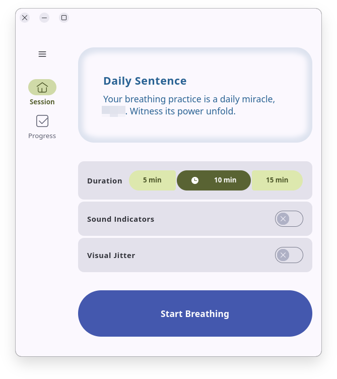

# Bremin

Breathing Mindfulness application written in Vala.

###



## 💝 Donations

Would you like to support the development of this app to new heights?
Then become a GitHub Sponsor or check my Patreon, buttons in the sidebar.

## 🛠️ Dependencies

Please make sure you have these dependencies first before building.

```bash
gtk4
libjson-glib
libgee-0.8
libhelium-1
meson
vala
```

## 🏗️ Building

Simply clone this repo, then:

```bash
meson _build --prefix=/usr && cd _build
sudo ninja install
```
